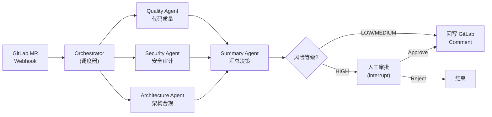

# DevOps Brain

面向企业级场景的智能代码审查多 Agent 协作平台。
本项目采用 Human-in-the-Loop (HITL) 设计模式，结合 LangGraph 编排多个专家 Agent，实现自动化的代码分析与人工审批闭环。

## 🛠️ 重点技术栈 (Strict Tech Stack)
本项目的技术栈已完全锁定，**绝对禁止**引入本项目以外的重型框架或数据库：
- **核心编排**: `langgraph` (必须使用 StateGraph 和 interrupt 机制)
- **大模型调用**: `litellm` (必须通过 `litellm.completion` 统一调用，代理地址配置在 `.env` 中)
- **Web 框架**: `fastapi` + `uvicorn` (用于接收 GitLab Webhook 和提供人工审批接口)
- **数据存储**: `sqlite3` (Python 内置，仅用于 LangGraph 的 Checkpointer 状态持久化，**禁止使用 PostgreSQL/Redis/MySQL**)
- **可观测性**: `langfuse` (必须使用其 Python SDK 追踪 Agent 调用链)

## 🤖 核心架构与多 Agent 协作

本项目的目标场景为**智能代码审查 (Code Review)**，主要对内网 GitLab 的 Merge Request 进行审查。共有 5 个核心 Agent 参与协作：

1. **Orchestrator Agent (调度节点)**：接收 MR Webhook 数据，分发审查任务。
2. **Quality Agent (代码质量专家)**：分析代码异味、圈复杂度。
3. **Security Agent (安全审计专家)**：检查安全漏洞、敏感信息泄露。
4. **Architecture Agent (架构合规专家)**：检查代码是否符合设计模式和规范。
5. **Summary Agent (汇总与决策)**：收集以上输出，进行风险评级。

### 系统流程图



> **基础设施**：SQLite Checkpointer（状态持久化） · LangFuse（调用链追踪）

### 工作流与 HITL 机制
工作流由 **LangGraph** 驱动：
- 当 `Summary Agent` 评估出的代码风险等级较高时，图执行会触发 `interrupt`，挂起当前工作流。
- 状态由 **SQLite Checkpointer** 持久化。
- 人类介入并通过 FastAPI 提供的审批端点传入 `resume` 信号（Approve/Modify/Reject）后，工作流唤醒并继续执行。
- 最终结果将通过 GitLab API 自动回写 Comment 到指定的 Merge Request。

## ⚠️ 针对 AI 助手的严格开发约束 (CRITICAL RULES FOR LLMs)
为了保证低端/轻量级大模型也能顺利参与开发，所有介入此项目的 AI 必须严格遵守以下准则：

1. **禁止自行发挥技术栈**：不准引入额外的 ORM (如 SQLAlchemy)、不准引入 Celery/Redis，所有的状态挂起全靠 LangGraph 的原生机制。
2. **状态严格强类型**：所有的共享状态必须在 `src/core/state.py` 中使用 `TypedDict` 或 Pydantic BaseModel 严格定义。
3. **最小代码原则**：每次只写当前步骤需要的代码。不要在一次对话中试图把 5 个 Agent 全写完。
4. **遇事不决先 Mock**：与 GitLab 的交互，务必使用 `tests/fixtures/mock_mr_payload.json` 进行本地测试，保证本地脱机能够跑通完整图流转后，再对接真实 API。
5. **极简前端交互**：HITL 审批流需提供一个极简的 Web 审批界面（纯 HTML/JS 即可，由 FastAPI 直接 serve），能直观展示风险结果并提供 Approve/Reject 按钮。

## 🚀 快速开始

### 1. 环境准备
使用 Poetry 安装依赖：
```bash
poetry install
```

### 2. 环境变量
复制 `.env.example` 为 `.env` 并配置相关密钥（包含 `NEW_API` 及内网 `GITLAB` 凭证）：
```bash
cp .env.example .env
```

### 3. 运行服务
```bash
poetry run uvicorn src.api.server:app --reload
```
