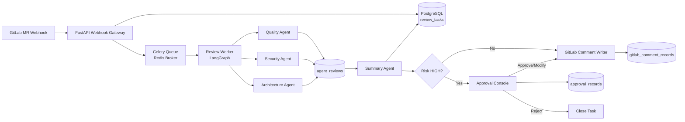

# DevOps Brain — 企业化落地演进计划

## 1. 目标定位

MVP 阶段已经验证了 Multi-Agent Code Review + HITL 的主链路。企业化阶段的目标是将系统从本地演示原型升级为可在团队内长期运行、可审计、可恢复、可扩展的 GitLab Merge Request 智能代码审查平台。

企业化阶段允许引入生产级基础设施，不再受 MVP 阶段 SQLite-only、无 ORM、无异步队列的约束限制。

## 2. 推荐技术栈

保留：
- FastAPI：Webhook 网关、审批 API、任务查询 API
- LangGraph：多 Agent 编排、HITL interrupt/resume
- LiteLLM：统一模型调用、Retry/Fallback
- Langfuse：LLM 调用链路追踪与 token 消耗审计
- GitLab API：MR diff 获取与评论回写

新增：
- PostgreSQL：审查任务、Agent 输出、审批历史、回写记录、审计日志持久化
- SQLAlchemy：数据库模型与事务管理
- Alembic：数据库 schema 迁移
- Redis：任务队列 broker、状态缓存、分布式锁
- Celery：Webhook 后台异步审查任务
- pgvector：历史审查经验库与相似问题召回
- MinIO/S3：可选，用于保存大 diff、报告快照、附件

## 3. 目标架构



## 4. 数据模型规划

### 4.1 review_tasks

一次 MR 审查任务的主表。

字段建议：
- `id`: bigint primary key
- `thread_id`: varchar, unique, LangGraph checkpoint thread id
- `project_id`: varchar
- `mr_iid`: varchar
- `mr_url`: text
- `source_branch`: varchar
- `target_branch`: varchar
- `title`: text
- `status`: varchar, `accepted/running/waiting_human/completed/rejected/failed`
- `final_risk_level`: varchar, `LOW/MEDIUM/HIGH`
- `summary_report`: text
- `final_comment`: text
- `error_message`: text
- `created_at`: timestamp
- `updated_at`: timestamp
- `completed_at`: timestamp

### 4.2 agent_reviews

保存每个专家 Agent 的输出，支持审计与复盘。

字段建议：
- `id`: bigint primary key
- `task_id`: bigint foreign key -> `review_tasks.id`
- `agent_name`: varchar, `quality/security/architecture/summary`
- `risk`: varchar
- `issues`: jsonb
- `raw_response`: text
- `error_message`: text
- `latency_ms`: integer
- `token_usage`: jsonb
- `model_name`: varchar
- `created_at`: timestamp

### 4.3 approval_records

保存人工审批历史。

字段建议：
- `id`: bigint primary key
- `task_id`: bigint foreign key -> `review_tasks.id`
- `thread_id`: varchar
- `decision`: varchar, `approve/reject/modify`
- `operator`: varchar
- `original_comment`: text
- `modified_comment`: text
- `comment_posted`: boolean
- `decided_at`: timestamp

### 4.4 gitlab_comment_records

保存 GitLab 评论回写记录，支持失败重试。

字段建议：
- `id`: bigint primary key
- `task_id`: bigint foreign key -> `review_tasks.id`
- `project_id`: varchar
- `mr_iid`: varchar
- `comment_body`: text
- `gitlab_note_id`: varchar
- `status`: varchar, `success/failed/retrying`
- `error_message`: text
- `created_at`: timestamp

### 4.5 audit_logs

保存操作审计。

字段建议：
- `id`: bigint primary key
- `actor`: varchar
- `action`: varchar
- `resource_type`: varchar
- `resource_id`: varchar
- `detail`: jsonb
- `created_at`: timestamp

### 4.6 review_knowledge

历史审查经验库，可结合 pgvector 做相似问题召回。

字段建议：
- `id`: bigint primary key
- `issue_type`: varchar
- `risk`: varchar
- `description`: text
- `suggestion`: text
- `embedding`: vector
- `source_task_id`: bigint
- `created_at`: timestamp

## 5. API 规划

### 5.1 Webhook

`POST /api/webhook`

职责：接收 GitLab MR webhook，创建 `review_tasks`，投递 Celery 任务，快速返回。

返回示例：
```json
{
  "status": "accepted",
  "thread_id": "xxx"
}
```

### 5.2 任务列表

`GET /api/reviews`

支持参数：
- `status`
- `risk`
- `project_id`
- `page`
- `page_size`

### 5.3 任务详情

`GET /api/reviews/{thread_id}`

返回内容：
- 任务基础信息
- Agent 输出
- Summary 报告
- 审批记录
- GitLab 回写记录

### 5.4 待审批列表

`GET /api/pending`

从 PostgreSQL 查询 `status = waiting_human` 的任务，不再依赖内存 dict。

### 5.5 人工审批

`POST /api/resume`

请求示例：
```json
{
  "thread_id": "xxx",
  "decision": "modify",
  "modified_comment": "人工修改后的 MR 评论"
}
```

行为：
- approve：写入 `approval_records`，回写原始 `final_comment`
- modify：写入 `approval_records`，回写 `modified_comment`
- reject：写入 `approval_records`，任务状态更新为 `rejected`，不回写普通审查评论

### 5.6 审批历史

`GET /api/history`

用于审计与页面展示。

## 6. 执行流程

1. GitLab 触发 MR Webhook。
2. FastAPI 校验 payload，创建 `review_tasks`，状态为 `accepted`。
3. FastAPI 投递 Celery 任务，立即返回 `thread_id`。
4. Celery Worker 拉取 MR diff，调用 LangGraph 执行多 Agent 审查。
5. 每个 Agent 的结果写入 `agent_reviews`。
6. Summary Agent 汇总风险，更新 `review_tasks`。
7. LOW/MEDIUM 自动回写 GitLab，任务状态更新为 `completed`。
8. HIGH 更新任务状态为 `waiting_human`，等待审批。
9. 审批端提交 approve/modify/reject。
10. 系统写入 `approval_records`，并按审批结果回写或结束。
11. 所有关键操作写入 `audit_logs`。

## 7. 分阶段实施计划

当前进度：
- Phase E1 已完成基础落地：已引入 SQLAlchemy / Alembic / PostgreSQL 驱动，新增三张核心表与 migration，并通过模型编译和全量测试。
- Phase E2 已完成第一版落地：`/api/pending`、`/api/resume`、`/api/history` 已接入数据库，审批页面已展示 Review History。
- Phase E3 已完成第一版落地：Webhook 已改为 Redis/RQ 异步入队，Worker 后台执行 LangGraph，任务运行状态、失败原因与重试次数已落库。
- Phase E4 已完成第一版落地：Agent 输出、GitLab 评论回写成功/失败记录已落库，提供任务详情接口与失败评论重试接口。
- Phase E5 已开始第一版落地：历史列表已支持按状态、风险、项目筛选，审批页面已补充工作台筛选栏与任务详情展开。
- 审计能力已开始第一版落地：新增 `audit_logs`，审批、任务重试、评论重试会记录操作者与操作详情。
- Phase E6 已开始第一版落地：新增 `review_knowledge` 经验库基础表，支持手动创建、查询，以及从审查任务的 Agent 问题沉淀经验；Quality / Security / Architecture Agent 已支持基础关键词召回并注入历史经验参考。

### Phase E1: 数据库基础设施

目标：建立企业级持久化基础。

任务：
- 引入 SQLAlchemy / Alembic / PostgreSQL 驱动
- 新增数据库配置与连接管理
- 创建 `review_tasks`、`agent_reviews`、`approval_records` 三张核心表
- 提供 Alembic migration

Done When：
- Alembic 可生成 PostgreSQL migration SQL：`poetry run alembic upgrade head --sql`
- API 可写入和查询 `review_tasks`
- 单元测试使用独立测试库或事务回滚：`poetry run pytest tests/test_db_models.py -v`

### Phase E2: 替换内存 pending 状态

目标：审批状态可持久化、可恢复。

任务：
- `/api/pending` 改为查询 `review_tasks.status = waiting_human`
- `/api/resume` 写入 `approval_records`
- 新增 `/api/history`
- 前端展示 `Review History`

Done When：
- 服务重启后仍能看到待审批任务和审批历史
- `/api/resume` 的 approve/modify/reject 均会写入 `approval_records`
- 审批页面展示 `Review History`

已完成：
- `/api/pending` 已优先查询 `review_tasks.status = waiting_human`
- `/api/resume` 已写入 `approval_records`，reject 会记录 `rejected` 且不回写评论
- `/api/history` 已提供最近审查任务列表
- 前端已补充 Review History 区域

剩余增强：
- 接入企业登录态替代 `X-Operator` 请求头
- 增加任务详情接口，展示每个 Agent 的审查输出
- 将 GitLab 评论回写记录拆到 `gitlab_comment_records`
- Approve/Modify/Reject 都有历史记录

### Phase E3: Webhook 异步化

目标：避免 GitLab Webhook 被 LLM 调用阻塞。

任务：
- 引入 Redis / Celery
- `/api/webhook` 创建任务后快速返回
- Celery Worker 后台执行 LangGraph
- 增加任务状态查询接口

Done When：
- Webhook 响应时间不依赖 LLM 耗时
- 后台失败可在任务详情中看到错误原因

已完成：
- `/api/webhook` 创建 `review_tasks` 后快速返回 `queued` 与 `job_id`
- `src.queue.worker` 后台执行审查任务，macOS 默认使用 `SimpleWorker` 避免 fork 崩溃
- `review_tasks` 已记录 `job_id`、`retry_count`、`initial_state`、`queued_at`、`started_at`、`failed_at`
- `/api/reviews/{thread_id}/retry` 支持失败或排队任务重新入队

### Phase E4: Agent 输出与回写记录落库

目标：完整审计每次审查。

任务：
- 每个 Agent 输出写入 `agent_reviews`
- GitLab 回写结果写入 `gitlab_comment_records`
- 失败评论支持重试
- Langfuse trace metadata 关联 `thread_id` / `task_id`

Done When：
- 任务详情页能看到每个 Agent 的发现、风险和原始输出
- GitLab 回写成功/失败都有记录

已完成：
- 每次图执行后的 `reviews` 会同步写入 `agent_reviews`
- 新增 `gitlab_comment_records`，记录自动回写、人工 approve/modify 回写与评论重试结果
- `/api/reviews/{thread_id}` 返回任务详情、Agent 输出、审批记录与 GitLab 回写记录
- `/api/reviews/{thread_id}/comments/retry` 支持只重试失败的 GitLab 评论回写
- 审批页面可展开任务详情并查看 Agent 输出、审批记录和评论回写记录

### Phase E5: 企业工作台

目标：从单页审批升级为任务工作台。

任务：
- 任务列表：按状态、风险、项目筛选
- 任务详情：展示 diff 摘要、Agent 输出、Summary、审批历史
- 审批台：批量查看 HIGH 风险任务
- 历史页：查看审批与回写记录

Done When：
- 用户可以从页面完成任务查看、审批、追踪历史
- Reject 后任务不再“消失”，而是进入历史列表

已完成：
- `/api/history` 支持 `status`、`risk`、`project_id`、`limit` 查询参数
- 审批页面 Review History 支持按状态、风险、项目筛选
- 任务列表可展开详情，查看 diff 摘要、Agent 输出、审批记录和 GitLab 评论回写记录
- 审批页面提供 HIGH 风险快速筛选入口

### Phase E6: 历史审查经验库

目标：让系统复用历史经验，提高审查一致性。

任务：
- 引入 pgvector
- 将高价值审查结果沉淀到 `review_knowledge`
- 审查前召回相似经验注入 Agent prompt
- 人工审批时支持标记“沉淀为经验”

Done When：
- 类似问题能召回历史审查建议
- Summary 报告可引用历史经验

已完成第一步：
- 新增 `review_knowledge` 表与 migration
- `GET /api/knowledge` 支持按问题类型、风险、来源线程、来源 Agent 查询
- `POST /api/knowledge` 支持手动创建经验
- `POST /api/reviews/{thread_id}/knowledge` 支持从审查任务的 Agent 问题沉淀经验
- 审批工作台历史任务卡片已提供“沉淀经验”入口，详情页可查看关联历史经验
- 新增基础关键词召回，专家 Agent 会将命中的历史经验注入 Prompt
- 专家 Agent issue 输出已结构化为 `title/type/description/suggestion/risk`，沉淀经验时会自动保留标题和修复建议；旧格式仅有 `description` 时会生成标题兜底

剩余增强：
- 引入 pgvector 并生成 embedding
- Summary 报告引用命中的历史经验

## 8. MVP 到企业版的迁移原则

- 保留 LangGraph 编排核心，不重写 Agent 主逻辑。
- 先把任务元数据和审批结果落库，再做异步队列。
- Checkpointer 仍可继续使用 SQLite 或切换到生产级持久化方案，但业务状态必须以 PostgreSQL 为准。
- 新增基础设施时必须补充可复制的本地启动说明，例如 Docker Compose。
- 每个企业化 Phase 结束都必须有自动化测试和一条可演示链路。
