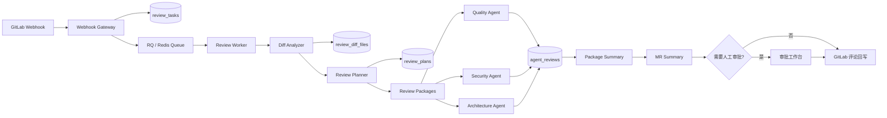

# DevOps Brain 企业化审查引擎落地计划

## 1. 背景与目标

当前系统已经完成企业化基础能力：Webhook 异步入队、PostgreSQL 持久化、审批工作台、审查历史、审计日志、历史经验库与 Langfuse 接入。

下一阶段的目标不是继续堆叠更多页面，而是把审查流程从“整个 MR 直接交给固定几个 Agent 看一遍”，升级为更接近企业真实落地的审查引擎：先理解 MR 的规模、文件类型、风险区域和变更意图，再按模块切分审查包，动态选择合适的专家 Agent，并把分片结果汇总成稳定、可审批、可回写、可复盘的结构化报告。

目标链路：

```text
Webhook
-> 提取 MR diff
-> Diff Analyzer 分析文件、行数、语言、目录、风险域
-> Review Planner 判断 MR 类型和审查策略
-> 按文件/模块切分 diff
-> 动态选择 Agent 并行审查
-> 汇总每个分片问题
-> Summary 生成总评
-> 大 MR / 高风险 MR 进入人工审批
-> 回写结构化评论
```

## 2. 核心原则

1. MR diff 使用目标分支与源分支的最终差异，不按每次 commit 单独审查。
2. 多个类或多个文件变更时，不为每个类完整跑一遍全量 Agent 流程，而是按目录、语言、职责和风险域组成审查包。
3. Diff Analyzer 与 Review Planner 第一版优先使用规则引擎实现，保证可解释、低成本、稳定。
4. LLM Agent 只处理经过裁剪的审查包，避免大 MR 直接塞进模型导致成本、上下文和稳定性问题。
5. 所有分析计划、分片结果、Agent 输出和汇总结果都要落库，便于审批、复盘和经验沉淀。
6. 高风险、大规模、跨核心模块、涉及安全或数据库变更的 MR 默认进入人工审批。

## 3. 目标架构



## 4. 开发阶段

### Phase 1：Diff Analyzer

目标：将原始 MR diff 转换为结构化文件变更清单。

需要实现：
- 解析 GitLab MR diff，识别每个变更文件。
- 提取文件路径、语言、扩展名、目录、变更类型、增删行数。
- 识别风险域：安全、数据库、配置、CI/CD、依赖、认证鉴权、API、核心业务、测试。
- 计算 MR 规模：文件数、总行数、最大单文件变更行数、是否大 MR。
- 将分析结果落库。

建议新增模块：
- `src/services/diff_analyzer.py`
- `src/models/review_diff_file.py`
- `migrations/versions/*_add_review_diff_files.py`
- `tests/test_diff_analyzer.py`

Done When：
- mock MR payload 可以解析出文件级结构化结果。
- 能准确识别 Python、SQL、YAML、JSON、Markdown 等常见文件类型。
- 能识别数据库迁移、配置文件、鉴权、安全敏感文件。
- `poetry run pytest tests/test_diff_analyzer.py -v` 通过。

### Phase 2：Review Planner

目标：根据 Diff Analyzer 结果生成审查策略和审查包。

需要实现：
- 判断 MR 类型：小改动、普通功能、重构、配置变更、数据库变更、安全敏感变更、大 MR。
- 按目录、语言、风险域聚合文件，生成 review packages。
- 为每个 package 选择需要执行的 Agent。
- 生成 MR 级审批策略：自动通过、需要人工审批、强制人工审批。
- 将审查计划落库。

建议新增模块：
- `src/services/review_planner.py`
- `src/models/review_plan.py`
- `src/models/review_package.py`
- `migrations/versions/*_add_review_plans.py`
- `tests/test_review_planner.py`

Done When：
- 普通业务 MR 只触发 Quality + Architecture。
- 涉及认证、权限、密钥、SQL 拼接时触发 Security。
- 涉及 migration/schema 时触发 Architecture + Quality，必要时触发 Security。
- 大 MR 会被拆成多个 package，并标记为需要人工审批。
- `poetry run pytest tests/test_review_planner.py -v` 通过。

### Phase 3：分片 Agent 执行

目标：让现有专家 Agent 从“审查整个 MR”升级为“审查指定审查包”。

需要实现：
- 扩展 Agent 输入，支持 package 级 diff、package metadata、相关历史经验。
- Agent 输出增加 `package_id`、`file_path`、`line_hint`、`issue_type`、`confidence` 等字段。
- 针对每个 package 动态执行选中的 Agent。
- 控制 LLM 输入长度，超长 package 需要截断并记录截断原因。
- 保留现有 Agent 的兜底行为，避免单个 package 失败导致整个任务失败。

建议改造模块：
- `src/agents/quality.py`
- `src/agents/security.py`
- `src/agents/architecture.py`
- `src/core/workflow.py`
- `src/core/state.py`
- `tests/test_agents.py`

Done When：
- 同一个 MR 可以产生多个 package review。
- 每个 package 只调用被 planner 选中的 Agent。
- Agent 输出能关联回具体 package 与文件。
- 单个 Agent 失败时任务继续执行，并在结果中保留失败信息。
- `poetry run pytest tests/test_agents.py -v` 通过。

### Phase 4：二级汇总

目标：先汇总每个审查包，再汇总整个 MR，避免大 MR 问题丢失或评论过长。

需要实现：
- Package Summary：汇总单个 package 的所有 Agent 发现。
- MR Summary：汇总所有 package summary，给出最终风险、阻断项、建议项、可选优化项。
- 输出结构化 GitLab 评论，包含总体结论、关键风险、分模块问题、历史经验参考。
- 对重复问题做归并，减少评论噪声。
- 评论超长时生成摘要版，完整结果保留在数据库详情页。

建议改造模块：
- `src/agents/summary.py`
- `src/services/review_task_service.py`
- `src/static/approval.html`
- `tests/test_summary.py`

Done When：
- 大 MR 评论仍然可读，不会简单堆叠所有 Agent 原文。
- HIGH 风险问题优先展示，LOW 风险问题不喧宾夺主。
- GitLab 回写评论与审批工作台详情一致。
- `poetry run pytest tests/test_summary.py -v` 通过。

### Phase 5：数据库与审计增强

目标：让审查计划、分片结果和最终输出完整可追踪。

需要实现：
- 新增或扩展表：`review_diff_files`、`review_plans`、`review_packages`、`package_summaries`。
- 审计日志记录 planner 策略、人工审批、评论回写、经验库引用。
- 支持按文件、风险域、Agent、MR 类型查询历史问题。
- 经验库沉淀时保留来源 package 与文件路径。

Done When：
- 任意任务详情可以回看：原始 MR 信息、diff 分析、审查计划、package、Agent 输出、审批记录、回写记录。
- 经验库可以追溯到来源 MR、来源文件、来源问题。
- Alembic migration 可从空库升级到最新 head。
- `poetry run alembic upgrade head` 成功。

### Phase 6：审批工作台展示审查计划

目标：让人工审批不只是看最终评论，而是能理解系统为什么这么审。

需要实现：
- 任务详情页展示 MR 规模、风险域、审查策略、审查包列表。
- 每个 package 展示涉及文件、执行 Agent、风险结论和主要问题。
- 支持按风险等级、Agent、文件路径筛选问题。
- 对被截断的 package 明确展示截断提示。

建议改造模块：
- `src/api/routes/approval.py`
- `src/static/approval.html`
- `tests/test_approval_api.py`

Done When：
- 审批人可以快速判断 MR 为什么进入人工审批。
- 审批人可以定位问题来自哪个文件、哪个审查包、哪个 Agent。
- Approve、Modify、Reject 仍保持当前行为稳定。

## 5. 推荐执行顺序

1. 先做 Phase 1，建立文件级 diff 结构化能力。
2. 再做 Phase 2，让系统知道“这次 MR 应该怎么审”。
3. 然后做 Phase 3，将现有 Agent 改造成 package 级执行。
4. 接着做 Phase 4，解决大 MR 汇总和评论可读性。
5. Phase 5 与 Phase 6 可以穿插，但每次 schema 变化都要带 migration 和测试。

## 6. 第一版落地边界

第一版不需要把每个能力都做到极致，重点是把架构骨架跑通：

- Diff Analyzer 使用规则，不调用 LLM。
- Review Planner 使用规则，不调用 LLM。
- LLM 仍只用于 Quality、Security、Architecture、Summary。
- 不做每行精确 inline comment，先做文件级和问题级定位。
- 不做复杂权限系统，先复用当前审批工作台。
- 不做自动 merge，审批通过只代表允许回写审查评论，不自动同意或合并 MR。

## 7. 自测清单

每个阶段完成后至少执行：

```bash
poetry run pytest tests -v
poetry run alembic heads
```

涉及数据库 schema 变更时执行：

```bash
poetry run alembic upgrade head
```

涉及 Webhook 链路时执行：

```bash
curl -X POST http://127.0.0.1:8000/api/webhook \
  -H "Content-Type: application/json" \
  -d @tests/fixtures/mock_mr_payload.json
```

涉及审批工作台时人工验证：

```text
http://127.0.0.1:8000/static/approval.html
```
